# Rural Care Connect — Technical Documentation

**Version:** 1.0 (MVP Demo)
**Last updated:** June 2026
**Deployment:** Docker · Local / Ubuntu
**Project:** Geriatric hybrid care — El Nido, Palawan (GIDA)

---

## Table of Contents

1. [Project Overview](#1-project-overview)
2. [System Architecture](#2-system-architecture)
3. [Container Architecture](#3-container-architecture)
4. [Database Schema](#4-database-schema)
5. [API Reference](#5-api-reference)
6. [Authentication & RBAC Flow](#6-authentication--rbac-flow)
7. [User Flows](#7-user-flows)
   - 7.1 [Patient Registration](#71-patient-registration)
   - 7.2 [Patient Login](#72-patient-login)
   - 7.3 [CHW Vitals Entry (with Offline Sync)](#73-chw-vitals-entry-with-offline-sync)
   - 7.4 [Teleconsultation Booking](#74-teleconsultation-booking)
   - 7.5 [Clinician Consultation Flow](#75-clinician-consultation-flow)
8. [Security Model](#8-security-model)
9. [Audit Trail](#9-audit-trail)
10. [Compliance Alignment](#10-compliance-alignment)
11. [Local Setup Guide](#11-local-setup-guide)
12. [Production Readiness Checklist](#12-production-readiness-checklist)

---

## 1. Project Overview

**Rural Care Connect** is a hybrid healthcare platform targeting elderly patients (≥60 years) with Type 2 Diabetes Mellitus (T2DM), Hypertension (HTN), and Chronic Ischaemic Heart Disease (CIHD) living in geographically isolated and disadvantaged areas (GIDA) of El Nido, Palawan, Philippines.

The MVP provides four core user roles and flows:

| Role | Primary function |
|------|-----------------|
| **Patient** | View own health records, vitals history, book & join teleconsultations |
| **Community Health Worker (CHW)** | Record patient vitals during home visits; works offline |
| **Clinician** | Manage consultations, write diagnoses, prescribe medications |
| **Admin** | Monitor platform health, view audit log, manage users |

### Technology stack

| Layer | Technology |
|-------|-----------|
| Frontend | React 18 + Vite, Recharts, React Router |
| Backend | Node.js 20, Express 4 |
| Database | PostgreSQL 16 |
| Auth | JWT (jsonwebtoken) + bcryptjs |
| Container | Docker + Docker Compose |
| Reverse proxy | nginx (serves SPA + proxies `/api`) |

---

## 2. System Architecture

```mermaid
graph TB
    subgraph Clients["👥 Clients (Browser)"]
        P[Patient]
        C[CHW]
        CL[Clinician]
        A[Admin]
    end

    subgraph Docker["🐳 Docker Compose Network"]
        direction TB

        subgraph FE["rcc_frontend — nginx :3000"]
            SPA[React SPA\nVite build]
            NX[nginx reverse proxy]
        end

        subgraph BE["rcc_backend — Node.js :4000"]
            EX[Express App]
            MW[JWT Middleware\n+ RBAC]
            AL[Audit Logger]
            subgraph Routes["Route Handlers"]
                R1[/auth]
                R2[/patients]
                R3[/vitals]
                R4[/consultations]
                R5[/admin]
            end
        end

        subgraph DB["rcc_db — PostgreSQL :5432"]
            PG[(PostgreSQL 16)]
        end
    end

    P & C & CL & A -->|HTTPS :3000| NX
    NX -->|Static files| SPA
    NX -->|/api proxy| EX
    EX --> MW --> Routes
    Routes --> AL
    Routes --> PG
    AL --> PG
```

---

## 3. Container Architecture

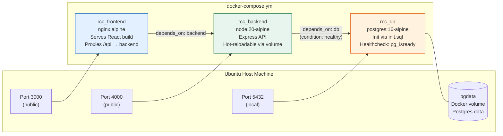

### Build pipeline

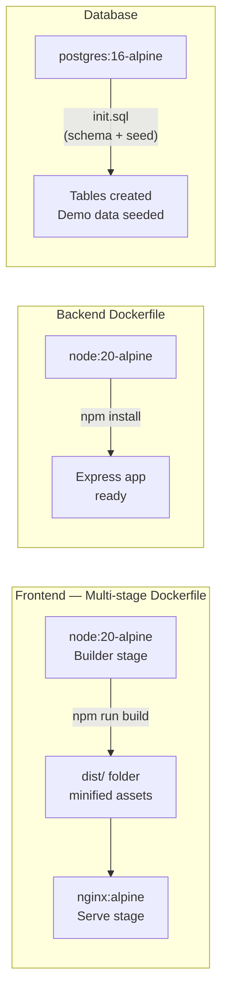

---

## 4. Database Schema

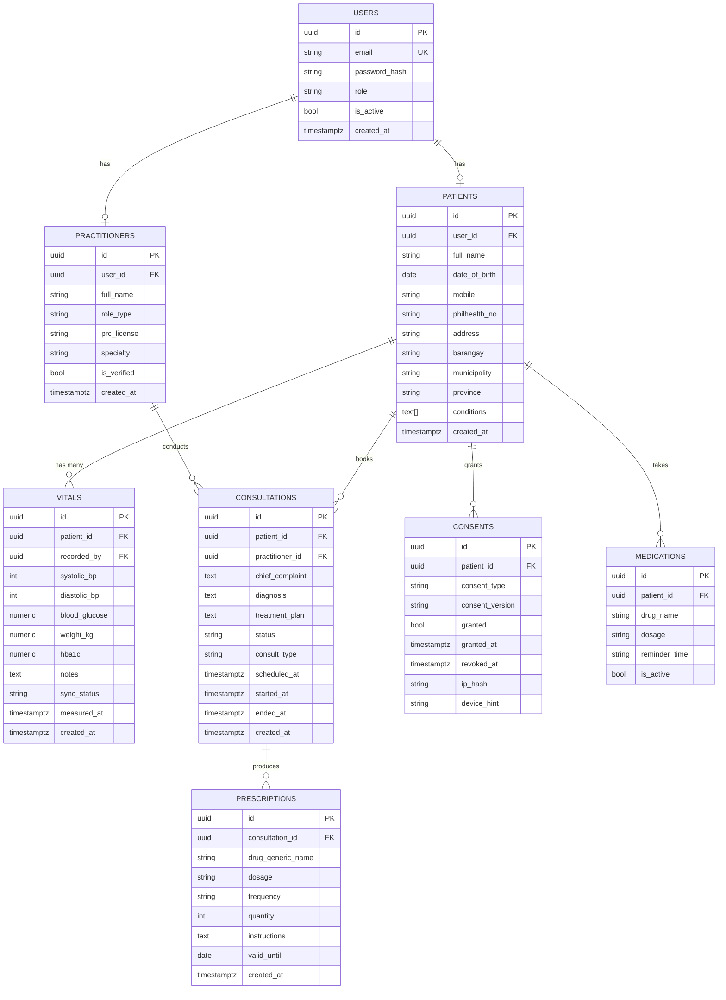

> **SPI fields** (Sensitive Personal Information under RA 10173): `full_name`, `date_of_birth`, `mobile`, `philhealth_no`, `blood_glucose`, `systolic_bp`, `diastolic_bp`, `hba1c`, `diagnosis`, `chief_complaint`, `treatment_plan`, `drug_generic_name`, `dosage`. In production these are AES-256-GCM encrypted at the application layer before write.

---

## 5. API Reference

### Base URL
```
http://localhost:3000/api   (via nginx proxy)
http://localhost:4000/api   (direct to backend)
```

### Authentication
All protected routes require:
```
Authorization: Bearer <JWT>
```

### Endpoints

#### Auth — `/api/auth`

| Method | Path | Auth | Description |
|--------|------|------|-------------|
| `POST` | `/login` | None | Login, returns JWT + role |
| `POST` | `/register` | None | Patient self-registration |

#### Patients — `/api/patients`

| Method | Path | Roles | Description |
|--------|------|-------|-------------|
| `GET` | `/` | clinician, chw, admin | List all patients (supports `?search=`) |
| `GET` | `/me` | patient | Patient views own record |
| `GET` | `/:id` | clinician, chw, admin | Get single patient |

#### Vitals — `/api/vitals`

| Method | Path | Roles | Description |
|--------|------|-------|-------------|
| `GET` | `/patient/:id` | all (patient sees own only) | List vitals for a patient |
| `POST` | `/` | chw, clinician | Record new vitals entry |

**Vital validation ranges:**

| Field | Min | Max | Unit |
|-------|-----|-----|------|
| Systolic BP | 60 | 300 | mmHg |
| Diastolic BP | 40 | 200 | mmHg |
| Blood glucose | 1.0 | 35.0 | mmol/L |

#### Consultations — `/api/consultations`

| Method | Path | Roles | Description |
|--------|------|-------|-------------|
| `GET` | `/` | patient, clinician, admin | List consultations (scoped by role) |
| `GET` | `/:id` | patient, clinician, admin | Get consultation + prescriptions |
| `POST` | `/` | patient, clinician, admin | Book new consultation |
| `PATCH` | `/:id` | clinician | Update diagnosis, plan, status |
| `POST` | `/:id/prescriptions` | clinician | Add prescription (RA 6675: generic name required) |

#### Admin — `/api/admin`

| Method | Path | Roles | Description |
|--------|------|-------|-------------|
| `GET` | `/stats` | admin | Dashboard stats + recent audit events |
| `GET` | `/audit` | admin | Full audit log (last 50–100 events) |
| `GET` | `/patients` | admin | All patients with vitals counts |

---

## 6. Authentication & RBAC Flow

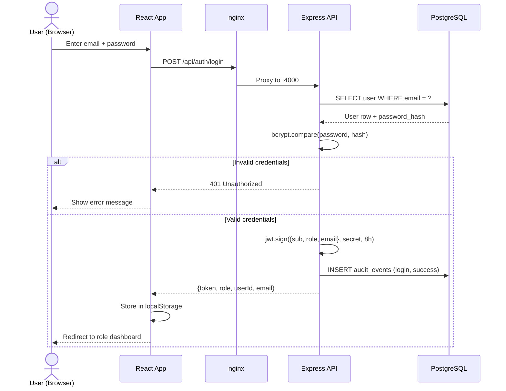

### RBAC permission matrix

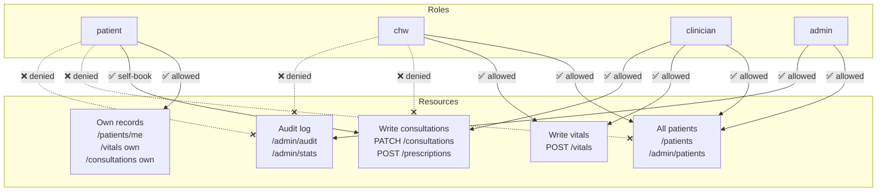

---

## 7. User Flows

### 7.1 Patient Registration

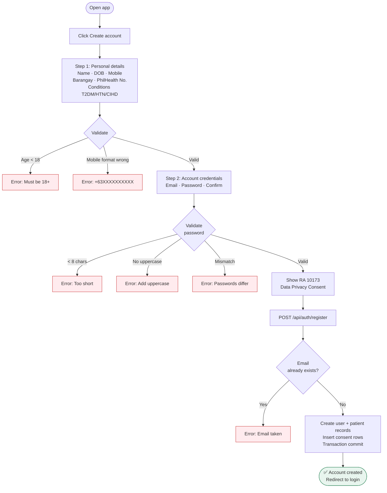

### 7.2 Patient Login

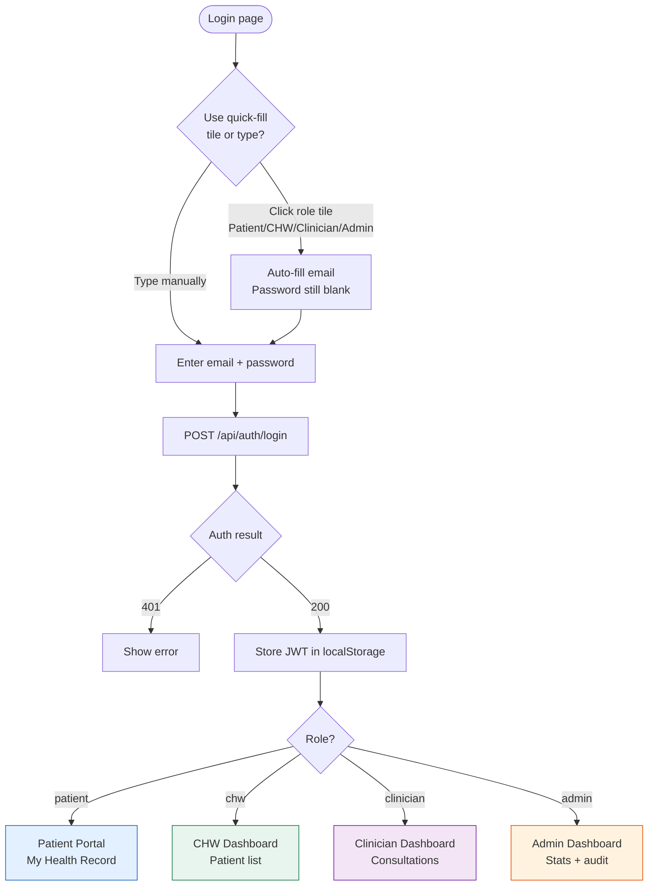

### 7.3 CHW Vitals Entry (with Offline Sync)

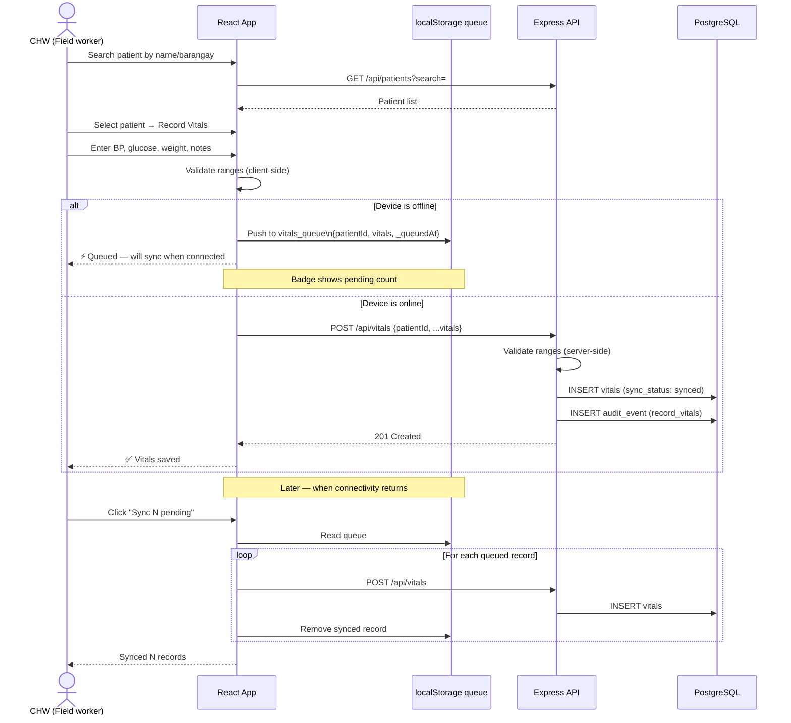

### 7.4 Teleconsultation Booking

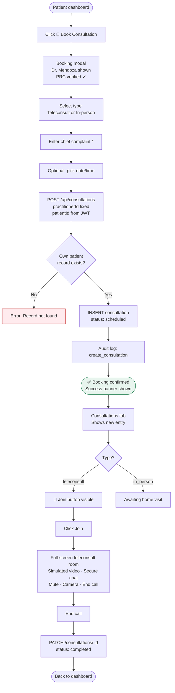

### 7.5 Clinician Consultation Flow

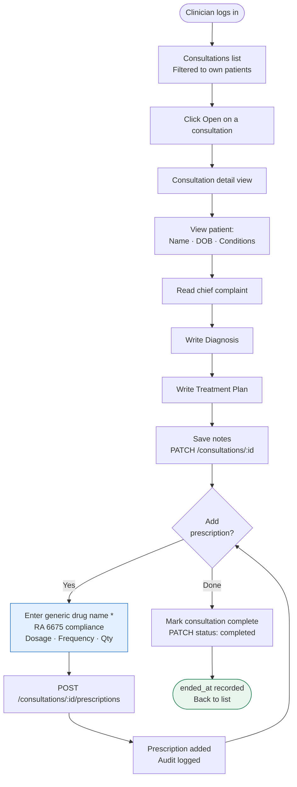

---

## 8. Security Model

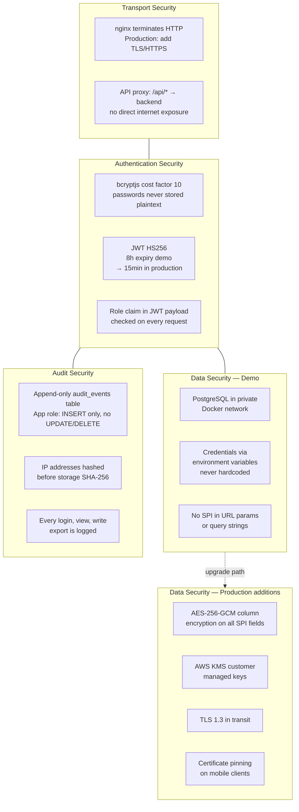

---

## 9. Audit Trail

Every data access event is written to `audit_events`. The application database role has `INSERT` only on this table — no `UPDATE` or `DELETE` — making it append-only.

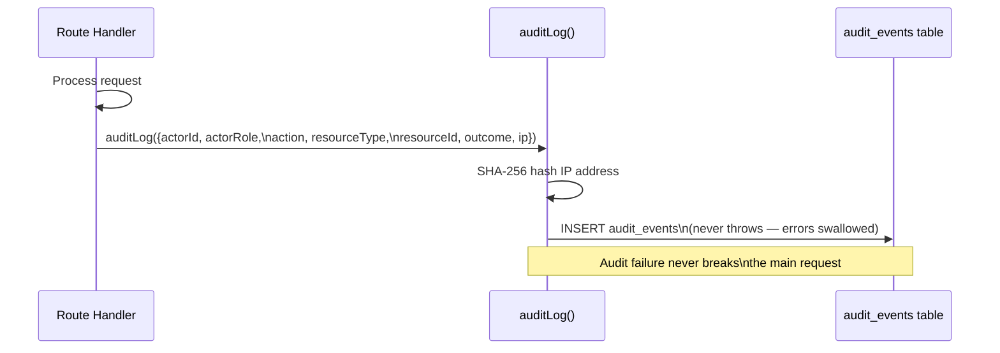

### Audited actions

| Action | Triggered by |
|--------|-------------|
| `login` | POST /auth/login (success or failure) |
| `register` | POST /auth/register |
| `list_patients` | GET /patients |
| `view_patient` | GET /patients/:id |
| `view_own_record` | GET /patients/me |
| `view_vitals` | GET /vitals/patient/:id |
| `record_vitals` | POST /vitals |
| `list_consultations` | GET /consultations |
| `view_consultation` | GET /consultations/:id |
| `create_consultation` | POST /consultations |
| `update_consultation` | PATCH /consultations/:id |
| `create_prescription` | POST /consultations/:id/prescriptions |
| `view_admin_stats` | GET /admin/stats |

---

## 10. Compliance Alignment

```mermaid
graph LR
    subgraph RA10173["RA 10173 — Data Privacy Act"]
        C1[Explicit consent on\nregistration step 2]
        C2[Consent rows stored\nimmutably with version]
        C3[Audit log: who accessed\nwhat data and when]
        C4[Breach path:\nGuardDuty → DPO alert\n→ NPC 72h notification]
    end

    subgraph DOH["DOH Telemedicine Guidelines"]
        D1[Teleconsult type\nrecorded per consultation]
        D2[Emergency disclaimer\npresent in booking + room UI]
        D3[Practitioner PRC license\ndisplayed and verified flag]
    end

    subgraph RA6675["RA 6675 — Generics Act"]
        G1[drug_generic_name field\nrequired on all prescriptions]
        G2[Backend enforces 400 error\nif generic name missing]
    end

    subgraph PhilHealth["PhilHealth"]
        PH1[PhilHealth number\ncollected at registration]
        PH2[Stored as SPI\nproduction: encrypted]
        PH3[Phase 2: eClaims\nAPI integration]
    end

    RA10173 --- DOH
    DOH --- RA6675
    RA6675 --- PhilHealth
```

---

## 11. Local Setup Guide

### Prerequisites
- Docker Desktop (or Docker Engine + Compose plugin)
- Ubuntu 20.04+ / any Linux with Docker
- Ports 3000, 4000, 5432 free

### First run

```bash
# 1. Unzip the project
unzip rcc-demo.zip && cd rcc-demo

# 2. Start all containers (builds on first run ~2-3 min)
docker compose up --build

# 3. Open browser
open http://localhost:3000
```

### Demo accounts

| Role | Email | Password |
|------|-------|----------|
| Patient | patient@demo.rcc | Demo1234! |
| CHW | chw@demo.rcc | Demo1234! |
| Clinician | doctor@demo.rcc | Demo1234! |
| Admin | admin@demo.rcc | Demo1234! |

### Useful commands

```bash
# View logs
docker logs rcc_backend -f
docker logs rcc_frontend -f
docker logs rcc_db -f

# Connect directly to database
docker exec -it rcc_db psql -U rcc_user -d rcc_demo

# Query audit log
docker exec rcc_db psql -U rcc_user -d rcc_demo \
  -c "SELECT action, actor_role, outcome, occurred_at FROM audit_events ORDER BY occurred_at DESC LIMIT 20;"

# Hot-patch a backend file without full rebuild
docker cp backend/src/routes/consultations.js rcc_backend:/app/src/routes/consultations.js
docker restart rcc_backend

# Wipe database and reseed
docker compose down -v && docker compose up --build

# Stop all containers
docker compose down
```

---

## 12. Production Readiness Checklist

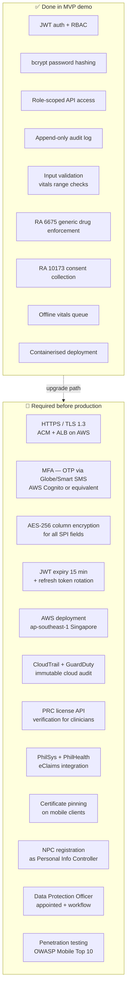

---

*This document covers the MVP demo implementation only. For the production AWS architecture, refer to `RuraCareConnect_HLD.pdf`.*
